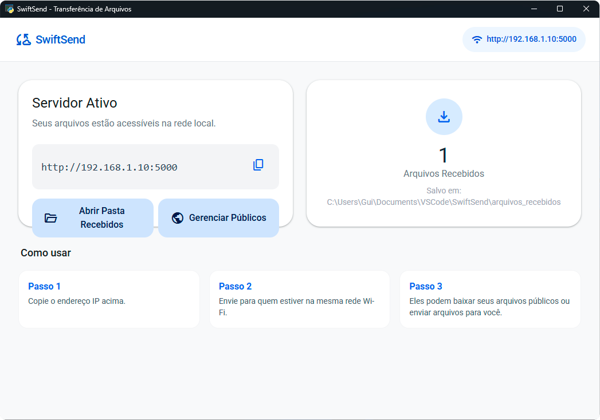
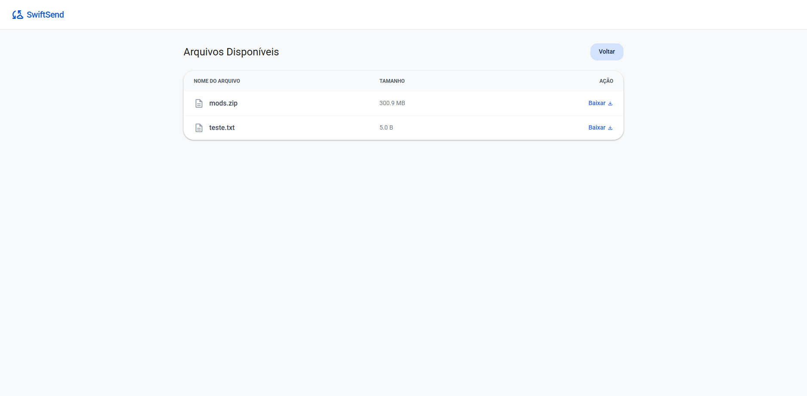
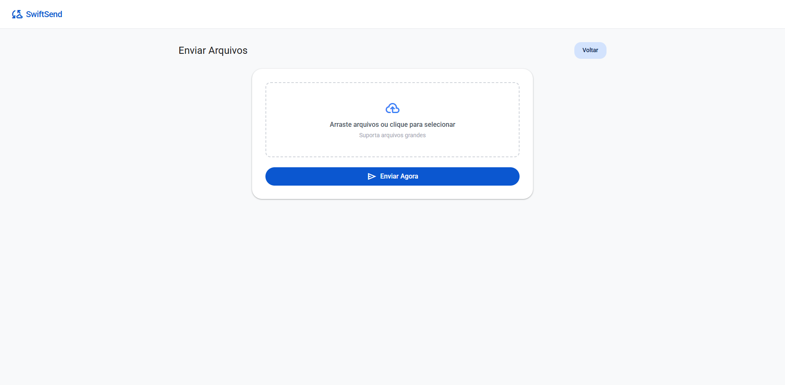

# **SwiftSend \- Transferência de Arquivos Local**

O **SwiftSend** é uma aplicação desktop leve e minimalista, desenvolvida em Python, que permite enviar e receber arquivos pesados através da sua rede local (Wi-Fi/LAN) utilizando o navegador.

O objetivo é eliminar a necessidade de pen-drives ou uploads lentos para a nuvem quando os dispositivos estão na mesma rede física.



## **✨ Funcionalidades**

- **Servidor Web Integrado:** Inicia um servidor Flask localmente acessível por qualquer dispositivo na rede.
- **Interface Desktop Nativa:** Janela limpa e responsiva utilizando `pywebview`.
- **Design Material You (Google-like):** Interface web moderna, minimalista e intuitiva.
- **Transferência Bidirecional:**
  - **Hospedar:** Disponibilize arquivos públicos para download.
  - **Receber:** Receba arquivos pesados de outros dispositivos (celulares, tablets, outros PCs).
- **Sem Limites de Internet:** A velocidade de transferência depende apenas da velocidade do seu roteador/cabo.
- **Zero Configuração:** O app detecta automaticamente seu IP local.

## **🛠️ Tecnologias Utilizadas**

- **Python 3.x**
- **Flask** (Backend do servidor web)
- **Pywebview** (Interface gráfica desktop)
- **TailwindCSS** (Estilização frontend)
- **PyInstaller** (Para gerar o executável)

## **🚀 Como Rodar o Projeto (Código Fonte)**

### **Pré-requisitos**

Certifique-se de ter o Python instalado. Em seguida, instale as dependências:

```python
pip install flask pywebview pyinstaller
```

### **Executando**

Basta rodar o arquivo principal:

```python
python app.py
```

Uma janela será aberta no seu computador mostrando o status do servidor e o link para compartilhamento.

## **📦 Como Gerar o Executável (.exe)**

O projeto inclui um script de build automatizado (`build.py`) que utiliza o PyInstaller para empacotar tudo em um único arquivo executável.

1. Abra o terminal na pasta do projeto.
2. Execute o script de build:

```python
python build.py
```

3. O executável `SwiftSend.exe` será gerado dentro da pasta `dist/`.

**Nota:** O executável é "portátil", ou seja, você pode copiá-lo para outro computador e rodar sem precisar instalar Python.

## **📖 Como Usar**

### **1\. Iniciando o Servidor**

Abra o aplicativo. Você verá o **Dashboard** com o endereço IP da sua máquina (ex: `http://192.168.0.15:5000`).

### **2\. Compartilhando Arquivos (Download)**

1. Clique em "Gerenciar Públicos" no aplicativo ou abra a pasta `arquivos_publicos` criada automaticamente.
2. Arraste qualquer arquivo que deseja compartilhar para dentro dessa pasta.
3. Qualquer pessoa que acessar o link do servidor verá esses arquivos disponíveis para download.



### **3\. Recebendo Arquivos (Upload)**

1. Envie o link do servidor (ex: `http://192.168.1.5:5000`) para a outra pessoa.
2. No navegador dela, ela deve clicar em **"Enviar Arquivos"**.
3. Ela pode selecionar múltiplos arquivos e enviá-los.
4. Os arquivos aparecerão automaticamente na pasta `arquivos_recebidos` no seu computador.



## **📂 Estrutura de Pastas**

Após a primeira execução, o software criará automaticamente:

- `arquivos_publicos/`: Coloque aqui o que você quer que os outros baixem.
- `arquivos_recebidos/`: Aqui chegam os arquivos que enviam para você.

## **📝 Licença**

Este projeto é de código aberto e livre para uso pessoal e educacional.
