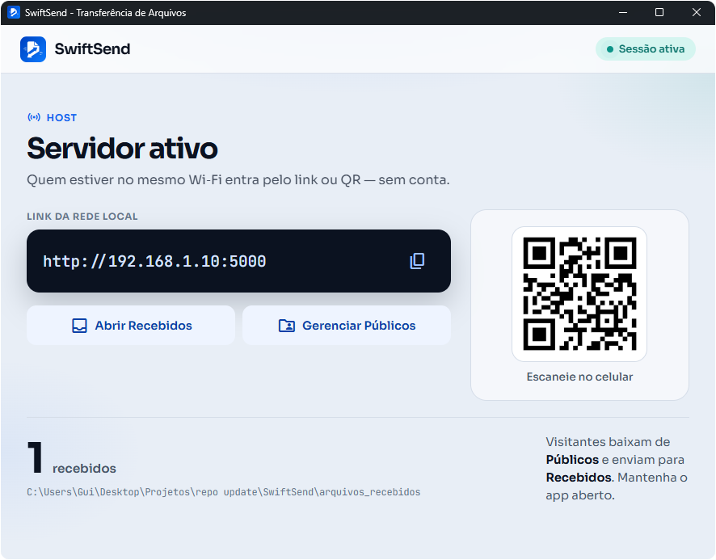

# **SwiftSend — Transferência de Arquivos Local**

O **SwiftSend** é uma aplicação desktop leve para enviar e receber arquivos pesados na rede local (Wi-Fi/LAN), sem pen-drive nem nuvem.



## Funcionalidades

- Servidor HTTP na LAN (`0.0.0.0:5000`)
- Janela desktop (WebView) com dashboard do host
- UI pública para visitantes (baixar / enviar)
- Pastas locais: `arquivos_publicos/` e `arquivos_recebidos/`
- Detecção automática do IP local

## Estrutura (dual-stack)

```
SwiftSend/
├── run.bat / run.sh     # atalho → versão Python
├── python/              # primária (Flask + pywebview)
├── csharp/              # secundária (ASP.NET + WebView2, Windows)
├── shared/              # UI única (templates + static + ícones)
├── installer/           # Inno (Win) / AppImage (Linux) / DMG (macOS)
├── demo/                # site estático (GitHub Pages)
└── docs/                # screenshots
```

Mesmo contrato HTTP nas duas backends; a UI vive em `shared/`.

## Stack

| | Primária | Secundária |
|--|----------|------------|
| Runtime | Python 3 | .NET 8 (Windows) |
| HTTP | Flask | ASP.NET Core / Kestrel |
| Desktop | pywebview | WebView2 (WPF) |
| UI | `shared/` | `shared/` |
| Build | PyInstaller | `dotnet publish` |

## Executar

Na raiz (Python por padrão):

```powershell
.\run.bat
```

```bash
./run.sh
```

Por stack:

```powershell
.\python\run.bat
.\csharp\run.bat
```

### Python (desenvolvimento)

```powershell
cd python
python -m venv venv
.\venv\Scripts\Activate.ps1
pip install -r requirements.txt
python main.py
```

### Python (build)

```powershell
cd python
python build.py
# Windows → python/dist/SwiftSend.exe
# Linux/macOS → python/dist/SwiftSend
```

Rode o build **no SO de destino** (PyInstaller não faz cross-compile).

### Instaladores

Empacotam o binário **Python** (PyInstaller).

**Windows** — [Inno Setup 6](https://jrsoftware.org/isinfo.php):

```powershell
.\installer\build_installer.ps1 -Version 1.0.0
# → installer/output/SwiftSend-Setup-1.0.0.exe
```

**Linux** (AppImage):

```bash
./installer/linux/build_appimage.sh 1.0.0
# → installer/output/SwiftSend-1.0.0-x86_64.AppImage
```

**macOS** (DMG, só no Darwin):

```bash
./installer/macos/build_dmg.sh 1.0.0
# → installer/output/SwiftSend-1.0.0-macos-arm64.dmg
```

Com o binário já gerado: `-SkipBuild` / `--skip-build`. Dados do usuário: `Documentos/SwiftSend`.

### C# (Windows — só desenvolvimento)

Requisitos: .NET 8 SDK e [WebView2 Runtime](https://developer.microsoft.com/microsoft-edge/webview2/).

```powershell
.\csharp\run.bat
```

Publish local (não entra no GitHub Release):

```powershell
.\csharp\publish.bat           # fdd + scd + r2r → csharp/dist/
.\csharp\publish.bat scd       # um perfil
```

Perfis em `csharp/SwiftSend/Properties/PublishProfiles/` (FDD exige .NET 8 Desktop + ASP.NET Core Runtime; SCD/R2R são self-contained; WPF não suportam Native AOT).

## Como usar

1. Abra o app — o dashboard mostra o link (ex.: `http://192.168.0.15:5000`).
2. Coloque arquivos em `arquivos_publicos/` (ou use **Gerenciar Públicos**).
   - Build frozen / instalado: `Documentos/SwiftSend/arquivos_publicos`.
   - Em desenvolvimento: pastas na raiz do repositório.
3. Na mesma rede, abra o link no navegador para baixar ou enviar.
4. Uploads chegam em `arquivos_recebidos/` (mesmo `DATA_ROOT`).

## Releases (CD)

Push de uma tag `v*` (ex.: `v1.0.0`) dispara o workflow **Release**:

1. PyInstaller (Windows amd64, Linux amd64, macOS arm64)
2. Instaladores: Inno Setup (Windows), AppImage (Linux), DMG (macOS)
3. Publica um [GitHub Release](../../releases) com instaladores + portables Python

Builds C# (FDD/SCD/R2R) ficam só no `csharp/publish.bat` local.

Para publicar:

```bash
git tag v1.0.0
git push origin v1.0.0
```

## Demo (GitHub Pages)

Demo **estática** da UI (sem transferência real), gerada a partir de `shared/`:

```powershell
pip install jinja2
python demo/build.py
# → demo/dist/
```

Push em `main` (alterações em `shared/` ou `demo/`) dispara o deploy Pages. No repositório: **Settings → Pages → Source: GitHub Actions**.

## Licença

Uso pessoal e educacional.
